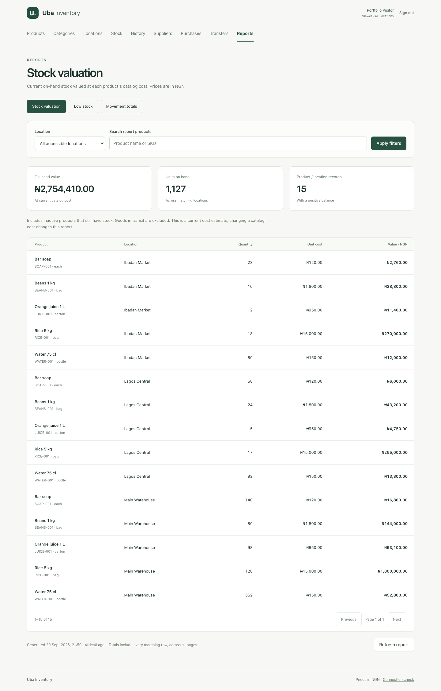
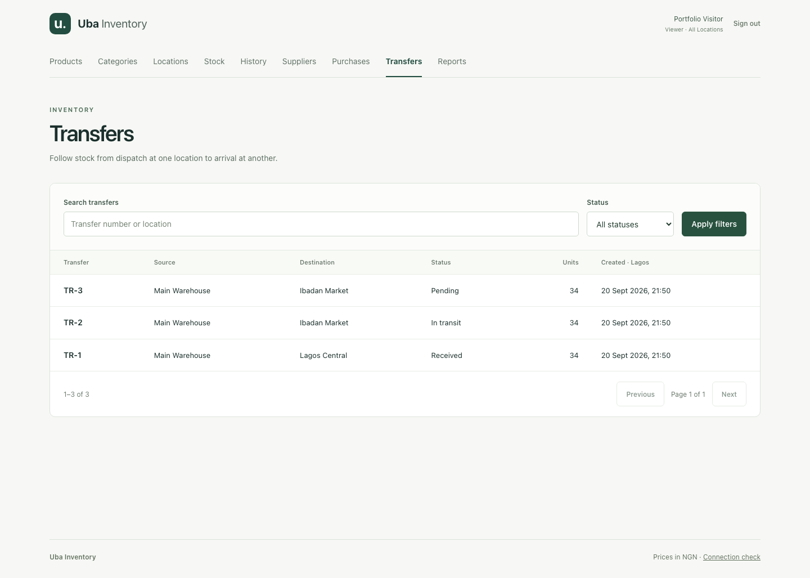

# Uba Inventory

A full-stack inventory management project being rebuilt in small, explainable milestones from an earlier AI-assisted prototype. This repository records the new implementation and the learning behind it.

**Current implementation: milestone 8 — portfolio and deployment preparation.** Catalog, authentication, store permissions, stock history, purchasing, transfers, and reports are working. The release adds a read-only demo mode, fictional workflow fixtures, container deployment, and backup/restore commands. The public Mac mini hostname has not been connected yet.

[Architecture](docs/architecture.md) · [Interview walkthrough](docs/interview-walkthrough.md) · [Deployment and recovery](docs/deployment.md) · [Build checks](https://github.com/lorenzoworx/Inventory-Management/actions)





## Run locally

Use Node.js 24, npm, and PostgreSQL 18. The PostgreSQL binaries (`initdb`, `pg_ctl`, `psql`, and `createdb`) must be on PATH.

```sh
git clone https://github.com/lorenzoworx/Inventory-Management.git
cd Inventory-Management
npm ci
npm run setup:local
npm run db:start
npm run db:migrate
npm run db:seed
npm run db:seed:users
npm run dev
```

Open http://127.0.0.1:5173 and sign in. Local account details are below. Vite serves React on port 5173 and forwards `/api` requests to Express on port 4000. Both bind to the local machine. Stop them with Ctrl+C.

The local database helper creates its own cluster under the ignored `.local/postgres` directory and listens on `127.0.0.1:5433`. It creates `ims` for development and `ims_test` for tests. It uses trust authentication for local learning only; the container deployment uses separate credentials and configuration. Existing PostgreSQL services are not reconfigured.

`npm run db:shell` opens psql for the development database. `npm run db:stop` stops this project's cluster while preserving its data; `db:start` starts it again. These helpers always target the local cluster, while migration and seed commands use `DATABASE_URL` from the environment or `.env`.

For a database hosted elsewhere, create separate development and test databases, set their URLs in `.env`, and skip `db:start`. The server requires DATABASE_URL and a SESSION_SECRET of at least 32 characters. The health endpoint checks the API process; catalog operations also require a reachable, migrated database.

To test the production arrangement, stop development first, then:

```sh
npm run build
npm start
```

Open http://127.0.0.1:4000. Express now serves the compiled frontend and the API from the same origin. React Router handles `/products`, `/products/new`, `/products/:id/edit`, `/categories`, `/stores`, `/stock`, `/movements`, `/suppliers`, `/purchases`, `/purchases/new`, `/purchases/:id`, `/transfers`, `/transfers/new`, `/transfers/:id`, `/reports/valuation`, `/reports/low-stock`, `/reports/movements`, `/login`, and the original `/connection` lesson. Express serves those routes correctly on refresh. `PORT` and `HOST` can configure this production server; keep the defaults for local use.

## Explore the request

```sh
curl -i http://127.0.0.1:4000/api/health
```

The response is HTTP 200 with JSON containing `status`, `service`, `checkedAt`, and `message`. The `/connection` page displays the message supplied by Express. This is an API process check. `/api/ready` checks database/catalog readiness and returns 503 while unavailable. Unknown `/api` routes return a JSON 404.

## Checks

```sh
npx playwright install chromium  # once per machine / browser version
npm run check                    # lint, typecheck, database tests, build, browser tests
```

Vitest applies migrations and seeds to `TEST_DATABASE_URL`, which must name a separate database ending in `_test`. Database and Supertest API tests roll back changes or remove their committed fixtures after concurrency checks. They cover catalog behavior plus unauthenticated requests, all non-admin catalog writes, cross-store access, live role changes, CSRF checks, login throttling, cookie security, logout, and PostgreSQL session persistence. Catalog SQL changes roll back; the auth suite uses the real PostgreSQL session store and removes its session fixtures. Run them with `npm run test:db`.

Playwright runs the production app on port 4199, independent of the dev server. It also uses TEST_DATABASE_URL, applies migrations/seeds before the tests, and cleans up the catalog records its journeys create. Tests cover login/logout, protected deep links, viewer screens and forbidden writes, assigned-store views, session loss, catalog operations, error recovery, phone layouts, keyboard access, and the original connection lesson. Run them with `npm run test:e2e`. `npm test` runs both suites; GitHub Actions does the same against a PostgreSQL 18 service.

## Repository map

```text
apps/web/            React UI and Vite development server
apps/api/            Express HTTP application and server entry point
packages/contracts/  Shared request/response schemas and TypeScript types
db/                  Handwritten migrations, fictional seed data, SQL exercise
scripts/             Local database lifecycle and migration/seed commands
tests/               Database/API checks with Vitest + Supertest; browser checks with Playwright
docs/                Prototype map, roadmap, decisions, and lessons
```

These are npm workspaces: one install and lockfile manage the packages together. The contracts package builds first because both applications import it. If you change a contract during development, restart `npm run dev` so its compiled output is refreshed.

## Learn alongside the build

Questions and practice tasks are kept privately in the local, Git-ignored `questions.md`. Unanswered exercises do not pause implementation. The [prototype map](docs/prototype-map.md), [HTTP lesson](docs/lessons/01-request-round-trip.md), [SQL lesson](docs/lessons/02-catalog-database.md), [catalog walkthrough](docs/lessons/02-catalog-api.md), [sessions and permissions lesson](docs/lessons/03-authentication.md), [stock ledger walkthrough](docs/lessons/04-stock-ledger.md), [purchasing walkthrough](docs/lessons/05-purchasing.md), [transfer walkthrough](docs/lessons/06-transfers.md), [reports walkthrough](docs/lessons/07-reports.md), and [release walkthrough](docs/lessons/08-release.md) explain the code. Keep personal explanations in [learning notes](docs/learning-notes.md); see the [roadmap](docs/roadmap.md) for remaining features.

The rebuild uses React, TypeScript, Express, and PostgreSQL with direct SQL. [Architecture decisions](docs/decisions.md) explain the choices. The public demo is configured to run in containers on a Mac mini through Cloudflare Tunnel, with read-only visitor access and fictional data. Follow the [release runbook](docs/deployment.md); hosting is still pending host/domain access.

## Development approach

This is a guided, AI-assisted rebuild. Changes are developed, tested, reviewed, and committed as working increments. The learner's exercises and explanations are recorded separately from implementation progress. Since 2026-09-18, development continues while learning questions accumulate for later review.

## Catalog API

| Method | Route | Behavior |
| --- | --- | --- |
| GET | /api/products | Search and paginate; active products by default |
| GET | /api/products/:id | Read one product |
| POST | /api/products | Create an active product |
| PUT | /api/products/:id | Replace editable catalog fields |
| PATCH | /api/products/:id/status | Set `isActive` explicitly |
| GET | /api/categories | Paginated category list |
| POST | /api/categories | Create a category |
| PUT | /api/categories/:id | Rename a category |

Product queries accept `q`, `categoryId`, `status=active|inactive|all`, `page`, and `pageSize`. Page size defaults to 20 and is capped at 100; pages are capped at 100,000. Search is a case-insensitive literal substring of name, SKU, or barcode. Lists sort by name and then ID. SKU, barcode, and category-name uniqueness currently remain case-sensitive.

Product bodies contain `sku`, `barcode` (string or null), `name`, `unit`, `costPrice`, `sellPrice`, and numeric `categoryId`. Prices are decimal strings, non-negative, at most two fractional digits and ten integer digits. The API returns prices with two fractional digits. Free products and selling below cost are allowed; stock quantity belongs to the separate product/store balance record.

Validation errors use HTTP 400, duplicate identifiers 409, missing records 404, oversized JSON bodies 413, and unexpected failures 500. Error bodies use `{ "error": { "code": "…", "message": "…", "fields": { "sku": "…" } } }`; `fields` is optional. Catalog reads require authentication; all catalog writes require ADMIN and a valid CSRF token. Public hosting remains a later release milestone.

## Local accounts and authentication

`npm run setup:local` creates missing values in the ignored `.env` file, restricts its file permissions, and preserves existing values. It generates random local passwords and a session secret without printing them. `db:seed:users` hashes the passwords with bcrypt (cost 12) and creates only missing accounts. Re-running it does not reset existing passwords or roles.

| Email | Password entry in .env | Access |
| --- | --- | --- |
| admin@uba.example | ADMIN_PASSWORD | Manage shared catalog; read all locations |
| viewer@uba.example | VIEWER_PASSWORD | Read catalog and all locations |
| manager@uba.example | MANAGER_PASSWORD | Read catalog; assigned to Lagos Central |
| staff@uba.example | STAFF_PASSWORD | Read catalog; assigned to Lagos Central |

The other fictional locations are Ibadan Market and Main Warehouse. Managers can record opening balances, sales, adjustments, and reorder points at their assigned store; staff can record sales there. Managers can create, order, and cancel purchases at their store; managers and staff can receive them. Managers can create/cancel transfers from their store; managers and staff can dispatch there and receive transfers addressed there. There is no public registration, password-reset flow, or account-management UI in this milestone. Account passwords must be at least 12 characters and at most 72 UTF-8 bytes when provisioned. Test credentials are separate and can only be seeded into a database ending in `_test`.

| Method | Route | Behavior |
| --- | --- | --- |
| GET | /api/auth/session | Current user or null, plus a session-bound CSRF token |
| POST | /api/auth/login | Verify credentials and replace the session ID/token |
| POST | /api/auth/logout | Delete the session and clear its cookie |
| GET | /api/stores | Paginated list restricted to accessible locations |
| GET | /api/stores/:id | Check access to the actual location record |

Writes, including login/logout, require the `x-csrf-token` header. The frontend fetches the current token immediately before a write; cookies travel automatically under the same origin. The session cookie is HttpOnly, SameSite=Lax, and expires after eight hours of inactivity. Identity lives in PostgreSQL, and each protected request reloads the user's current active status, role, and store assignment.

Secure cookies are enabled unless `COOKIE_SECURE=false`. The local helper explicitly disables that flag for loopback HTTP. Deployment must use `COOKIE_SECURE=true` and HTTPS; `TRUST_PROXY=loopback` is available only when a trusted proxy connects from loopback. The supplied tunnel container shares the app network namespace and connects from loopback, matching this trust setting. Failed logins are limited to ten per IP per fifteen minutes; the limiter is in memory and resets on API restart. Sessions persist across restarts when the secret and PostgreSQL data remain the same.

## Stock and movement history

Choose a location on the Stock page. Products start at zero until an administrator or that location's manager records an opening balance. The catalog seed does not invent stock counts. Record sales as positive quantities to subtract; adjustments accept signed quantities and require a reason. Movement history remains available after deactivating a product. Inactive products with remaining stock stay visible for corrective adjustments.

| Method | Route | Behavior |
| --- | --- | --- |
| GET | /api/stock | Product/store balances; required storeId, optional q/page/pageSize |
| POST | /api/stock/changes | Opening balance, sale, or signed adjustment |
| PUT | /api/stock/reorder | Set a location-specific reorder point |
| GET | /api/movements | Store-scoped history; optional q/productId/kind/page/pageSize |

A change body has `requestId` (UUID), `productId`, `storeId`, `kind` (`OPENING`, `SALE`, `ADJUSTMENT`), integer `quantity`, and `note`. The note is required for adjustments. A change is capped at 1,000,000 units; zero and fractional units are rejected. Reorder bodies contain `productId`, `storeId`, and non-negative `reorderPoint`.

Every change uses one transaction for the request claim, balance, and history. Duplicate identical submissions from the same user return the saved result (HTTP 200); new entries return 201. Reusing a UUID with different data, overselling, or attempting a second opening balance returns 409. Opening stock and adjustments require ADMIN or a manager assigned to that store; staff can sell at their assigned store; viewers cannot write.

```sh
npm run db:verify-ledger
```

This read-only check exits with code 1 if any balance differs from summed movements. Tests cover simultaneous sales, repeated requests, concurrent opening balances, a forced movement-write failure, and a lost-response browser retry. The UI formats movement timestamps in Africa/Lagos. Movement history has no update/delete endpoint; correct errors with another adjustment.


## Suppliers and purchases

Suppliers are shared contacts with optional email, phone, and address. ADMIN manages and deactivates them; all authenticated roles can read them. The seed includes two fictional suppliers. Deactivation preserves existing orders.

| Method | Route | Behavior |
| --- | --- | --- |
| GET | /api/suppliers | Search by q; status=active/inactive/all; page/pageSize |
| GET | /api/suppliers/:id | Read a contact |
| POST | /api/suppliers | Create a supplier (ADMIN) |
| PUT | /api/suppliers/:id | Update contact details (ADMIN) |
| PATCH | /api/suppliers/:id/status | Set isActive (ADMIN) |
| GET | /api/purchase-orders | List accessible orders; q/storeId/status/page/pageSize |
| GET | /api/purchase-orders/:id | Read an order and its lines |
| POST | /api/purchase-orders | Create a draft at an accessible store (ADMIN/MANAGER) |
| POST | /api/purchase-orders/:id/order | Mark a draft ordered (ADMIN/MANAGER) |
| POST | /api/purchase-orders/:id/cancel | Cancel before any receipt (ADMIN/MANAGER) |
| POST | /api/purchase-orders/:id/receive | Receive whole units (ADMIN/MANAGER/STAFF at the destination) |

An order body contains `supplierId`, `storeId`, optional `notes`, and 1–50 `lines` with `productId`, `orderedQty`, and decimal-string `unitCost`. Duplicate products are rejected. PostgreSQL sequences assign `PO-…` numbers; gaps are normal. Draft lines are currently fixed after creation: cancel an incorrect draft and create a replacement.

A receipt body contains a UUID `requestId` and `lines` with `lineId` and positive integer `quantity`. Include only arriving lines. The whole receipt commits or rolls back together, including movement history and the order status. A replay returns the saved receipt result; reload the order to see its latest state. The browser does this automatically. New receipts return 201; identical retries return 200; invalid transitions, over-receipt, or UUID reuse with different data return 409.

The lifecycle is DRAFT → ORDERED → PARTIALLY_RECEIVED → RECEIVED, with full deliveries able to skip the partial state. Cancellation is allowed only before any receipt. Creation/ordering require active suppliers and products; previously ordered goods can still be received after deactivation. Costs are snapshots on the order lines and do not update the product's catalog cost. Returns, taxes, freight, and weighted-average costing are outside this milestone.

Tests include real concurrent receipts, cancellation/receipt races, a forced second-line failure with complete rollback, safe lost-response retries, and matching stock totals. Purchase movements appear in History as “Purchase receipt” with the order number. No supplier email is sent by this application.


## Transfers between locations

| Method | Route | Behavior |
| --- | --- | --- |
| GET | /api/transfers | Accessible incoming/outgoing transfers; q/storeId/status/page/pageSize |
| GET | /api/transfers/destinations | Paginated location directory for choosing a destination; no stock data |
| GET | /api/transfers/:id | Read header and lines when either end is accessible |
| POST | /api/transfers | Create a pending transfer (ADMIN or source MANAGER) |
| POST | /api/transfers/:id/cancel | Cancel a pending transfer (ADMIN or source MANAGER) |
| POST | /api/transfers/:id/dispatch | Subtract all source quantities (ADMIN or source MANAGER/STAFF) |
| POST | /api/transfers/:id/receive | Add all destination quantities (ADMIN or destination MANAGER/STAFF) |

Create with `sourceId`, `destinationId`, optional `notes`, and 1–50 `lines` containing `productId` and positive whole `quantity`. Source and destination must differ. Duplicate products and quantities above 1,000,000 per line are rejected. PostgreSQL assigns a `TR-…` number. Active products are required for creation; existing transfers can finish after product deactivation.

Dispatch and receipt bodies each contain a separate UUID `requestId`. New actions return 201, identical same-user retries return 200, and invalid transitions or reused IDs return 409. Dispatch rejects insufficient source stock and rolls back every line. Receipt likewise commits all destination movements together. Transfer actions appear in stock history with the transfer number.

The lifecycle is PENDING → IN_TRANSIT → RECEIVED, or PENDING → CANCELLED. Pending transfers do not reserve stock. During transit, quantities have left the source but are not yet included at the destination. Transfer lines are fixed, and dispatch/receipt always cover all lines. Partial transfer receipts, losses in transit, and returns require future workflows.


## Reports

| Method | Route | Behavior |
| --- | --- | --- |
| GET | /api/reports/valuation | Positive on-hand balances × current catalog cost; includes inactive stock |
| GET | /api/reports/low-stock | Active products at or below each location's reorder point |
| GET | /api/reports/movements | Fourteen Lagos calendar dates, including dates with no activity |

All reports accept optional `storeId` and `q` (literal product-name/SKU search). Omit storeId to include all accessible locations: ADMIN/VIEWER see all, while MANAGER/STAFF see only their assigned store. Explicit inaccessible stores return 403. Valuation and low-stock reports accept bounded `page`/`pageSize`; their summary totals cover every matching row across pages.

Valuation uses current catalog costs, not saved purchase costs or a historical/weighted-average method. It excludes goods in transit until receipt. Monetary values and aggregated quantities are strings to preserve precision. Low-stock attention includes equality with the reorder point and never-stocked active products with zero quantity; inactive products are excluded from reorder attention.

Movement reports accept `endDate=YYYY-MM-DD` from 2000 through 2100, defaulting to today in Africa/Lagos. The window includes the ending day and the previous 13 days, from Lagos midnight inclusive through the next midnight exclusive. Opening balances, purchases, sales, adjustments in/out, and transfers in/out are shown separately. Outgoing quantities are positive magnitudes; net change is signed. These are unit totals, not revenue or profit. The current day can change as new movements arrive.

Report tests use hand-calculated fixtures, exact decimal totals, timezone boundaries down to microseconds, leap day, permissions, pagination, and movements posted by the real purchase/transfer services. The browser retains filters in the URL and supports retries, empty results, keyboard access, and phone layouts.


## Portfolio release

The Docker runtime serves the compiled app with production dependencies and a separate PostgreSQL login that cannot rewrite movement history. The maintenance image handles migrations, user provisioning, fictional demo fixtures, and verification. GitHub CI additionally builds the containers, checks repeatable seeding, restores a backup into a fresh database, compares business rows and sequence positions, and checks persistent sessions after restart.

```sh
npm run setup:deploy
npm run deploy -- build
npm run deploy -- migrate
npm run deploy -- seed
IMS_LOCAL_HTTP=1 npm run deploy -- up
```

The local container preview is at http://127.0.0.1:4200. Choose **Explore read-only demo**, or use `viewer@uba.example` / `Explore-Uba-Inventory`. These public credentials belong only to the fictional demo; ordinary local-development passwords remain private. Public-demo mode rejects operational logins and inventory writes at the server.

Full commands, Cloudflare setup, private backup handling, non-destructive restore, and manual deployment steps are in [Deployment and recovery](docs/deployment.md). Generate fresh screenshots from a running fictional demo with `npm run screenshots`. The [release lesson](docs/lessons/08-release.md) explains the build and recovery design. Screenshots in this README are from a local fictional release instance, not evidence of public hosting.
