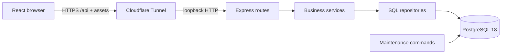
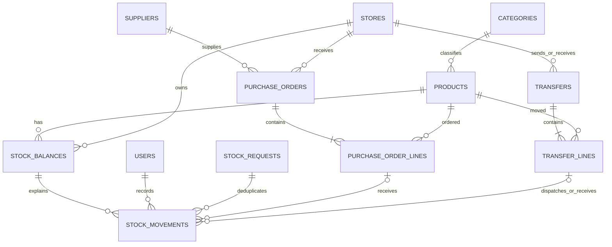

# Architecture

Uba Inventory separates the shared catalog from stock owned by each location. A product's name and price are shared; its quantity and reorder point belong to a product/store balance. The application is one deployable server, one PostgreSQL database, and a React frontend served by that same server.

In development Vite serves the frontend and proxies `/api` to Express. Production builds static frontend assets once; Express serves both HTML/assets and JSON. Shared Zod contracts describe input and output across that boundary, but the server still validates untrusted input at runtime. TypeScript alone cannot validate a request sent by a browser or another client.

The diagram shows conceptual relationships; the handwritten migrations are authoritative for columns, constraints, indexes, and composite foreign keys. Session records store an opaque cookie's server-side identity, separate from inventory records.

## One sale through the system

React sends a positive whole sale quantity, product/store IDs, and a request UUID. The browser includes the session cookie and current CSRF token. Express reloads the active user's current role/store assignment, validates the JSON, and asks the stock service to perform the operation.

The service starts a transaction using one checked-out PostgreSQL connection. It checks store access, claims the request ID, checks the product, locks/creates the product/store balance, and applies a conditional decrement. A negative balance fails before commit. The signed sale movement and resulting balance are recorded together; the saved request result supports an identical retry. Any failure rolls everything back. The HTTP response updates the screen only after commit.

For two sales of seven units against a balance of ten, one succeeds and leaves three; the other cannot decrement below zero. The history records only the successful change. A retry with the same UUID returns its saved result; a different UUID represents another requested operation. A UUID reused with a different payload is rejected.

## Workflows and reports

Purchase receiving locks the order before checking remaining quantities. All received lines, balances, history, and order status share one transaction. Transfers lock the document, subtract at dispatch, and add at receipt; goods in transit are intentionally absent from both on-hand balances. Pending transfers do not reserve stock.

Reports read this same data. SQL performs exact decimal arithmetic, aggregation, and Africa/Lagos date grouping. Valuation uses current catalog cost, not historical cost of goods sold. Each report's rows and summary come from one SQL statement and therefore one statement snapshot. Large aggregate counts and money cross JSON as strings.

## Boundaries and tradeoffs

Routes handle HTTP and validation; services enforce workflow rules and transactions; repositories contain parameterized SQL. This structure appeared when stock workflows needed it rather than starting with empty layers. There is no ORM, queue, microservice, Redux store, or generic repository framework.

An append-only ledger makes changes explainable, while the balance table makes current inventory reads inexpensive. Both must be maintained together. The application provides no history-editing endpoint; deployment grants additionally deny runtime updates/deletes on movements. A privileged maintenance owner still has the ability to repair or restore the database and must be kept private.

The public demo adds an application-wide business-write block and accepts viewer logins only. The normal development application retains ADMIN, MANAGER, STAFF, and VIEWER behavior. UI visibility helps usability; API checks provide enforcement.
