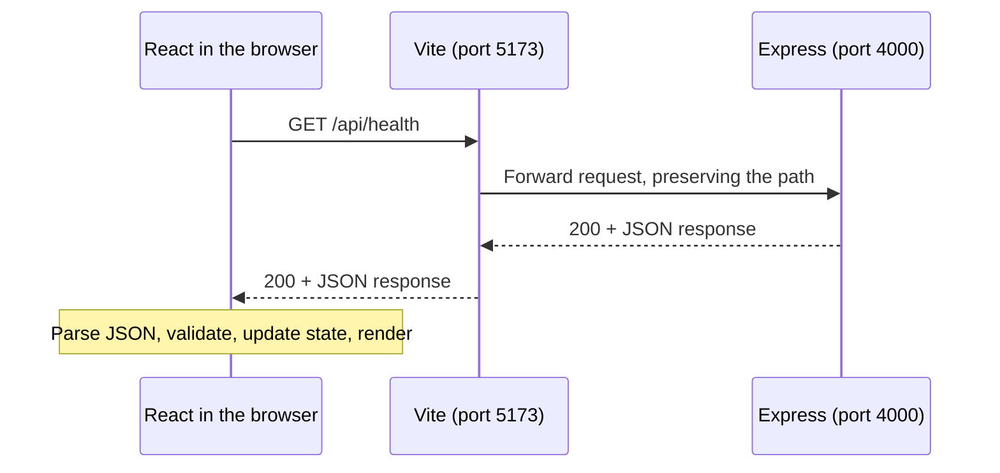

# Lesson 1: browser → server → browser

## What this lesson builds

A page that asks the API whether it is running and displays the answer. There is no inventory database yet. The goal is to understand the path that future product and stock requests will follow.

Run `npm run dev` from the repository root and open http://127.0.0.1:5173.

## Read the implementation in this order

Paths below are relative to the repository root.

1. **`apps/api/src/app.ts`:** `app.get("/api/health", ...)` handles an HTTP GET request and returns JSON. The route describes behavior; it does not start listening on a port.
2. **`apps/api/src/server.ts`:** starts the HTTP listener on port 4000. Separating this from the app definition will let us test routes without starting the normal server later.
3. **`packages/contracts/src/index.ts`:** defines the response shape. The Zod schema exists at runtime; `HealthResponse` is a TypeScript type derived from that schema.
4. **`apps/web/src/api.ts`:** sends the request with `fetch`, checks the HTTP status, parses JSON, and validates the received data.
5. **`apps/web/src/App.tsx`:** stores the connection state and renders the corresponding UI. An effect starts the request. Clicking the button changes `attempt`, so the effect runs again.
6. **`apps/web/vite.config.ts`:** forwards development requests beginning with `/api` to port 4000. This proxy is development tooling; it does not run in the browser.

## Trace the round trip



In production, Express also serves the frontend's built HTML, CSS, and JavaScript. The browser then talks directly to Express on port 4000; Vite is absent.

## Concepts to connect

| Concept | What it means here |
| --- | --- |
| HTTP method and path | `GET /api/health` identifies the operation the browser requests. |
| Port | A number identifying a listening service on the machine. Two processes use different ports in development. |
| JSON | Text carrying structured data between processes. It is parsed into a JavaScript value. |
| State | Data React remembers between renders. Updating it causes React to render the appropriate view. |
| Union type | `ConnectionState` allows loading, connected-with-data, or error-with-message; it avoids contradictory boolean flags. |
| Effect | Connects the rendered component to an external system: here, an HTTP request. Cleanup cancels obsolete work. |
| Validation | Checks that the value actually received matches the contract. A TypeScript annotation cannot validate network data. |
| npm script | A named command in package.json; `npm run dev` builds shared code and starts both services. |
| Workspace | A local package managed with the others under one repository and one lockfile. |

`fetch` rejects network failures, but an HTTP 503 still produces a response. That is why the code checks `response.ok`. Requests also time out after five seconds so the page cannot remain stuck indefinitely.

React Strict Mode can start, clean up, and restart an effect in development. Seeing an aborted request followed by a successful one can be expected. The abort controller prevents an obsolete response from updating the page.

## Inspect it yourself

1. Open browser developer tools and select **Network**. Click **Check again**.
2. Find `/api/health`. Read its method, status code, and response body.
3. Notice that the browser sees port 5173 in development, although Express listens on 4000: Vite forwards the request.
4. Call `curl -i http://127.0.0.1:4000/api/health` in a separate terminal. The API also works without React.
5. Request `/api/missing` with curl. Explain what changed in the HTTP status and response.

## Break and recover the connection

The combined dev command stops both processes together, so use separate terminals for this exercise:

```sh
# Stop npm run dev first, then run this once from the root:
npm run build -w @ims/contracts

# Terminal A:
npm run dev -w @ims/api

# Terminal B:
npm run dev -w @ims/web
```

Open the page, stop only Terminal A with Ctrl+C, and click **Check again**. Vite may return an HTTP 500 because its proxy cannot reach Express. That is different from the browser itself being unable to make a network connection. Restart Terminal A and click **Try again**. Describe why a full page reload was unnecessary.

## Your coding exercise — message from the server

Status: implemented by the learner and verified. The instructions below remain as a record of the exercise.

Add a `message` string to the health response and display it on the page. Use the text **Ready to build the catalog.**

Acceptance criteria:

- The server sends the message as JSON.
- The shared schema validates the field, and the derived type includes it.
- React renders the received value in a paragraph. Do not hard-code that paragraph's text in the component.
- The loading, failure, and retry behavior still works.
- `npm run check` passes.

Hint: start with the shared schema, rebuild it, and let TypeScript point out the server response that needs updating. Then use `connection.data` in the connected branch of the UI. Restart the dev command after editing shared contracts.

Before writing code, predict which files will change and why. Afterward, inspect `git diff` and explain each change. Record your answers in `docs/learning-notes.md`, then make a separate exercise commit once reviewed.

## Explain it back

1. What happens, step by step, after clicking **Check again**?
2. Why use a relative URL in `fetch("/api/health")`?
3. How does an HTTP 500 differ from a network failure?
4. Why do we need Zod if TypeScript already describes the response?
5. What changes when we run the production build?
6. Why does a successful health response not prove that inventory data is available?

Finish this exercise and discussion before beginning milestone 2.

## References for this lesson

- [React: useEffect and cleanup](https://react.dev/reference/react/useEffect)
- [Express: routing](https://expressjs.com/en/guide/routing.html)
- [Vite: development proxy](https://vite.dev/config/server-options.html#server-proxy)
- [MDN: using fetch](https://developer.mozilla.org/en-US/docs/Web/API/Fetch_API/Using_Fetch)
