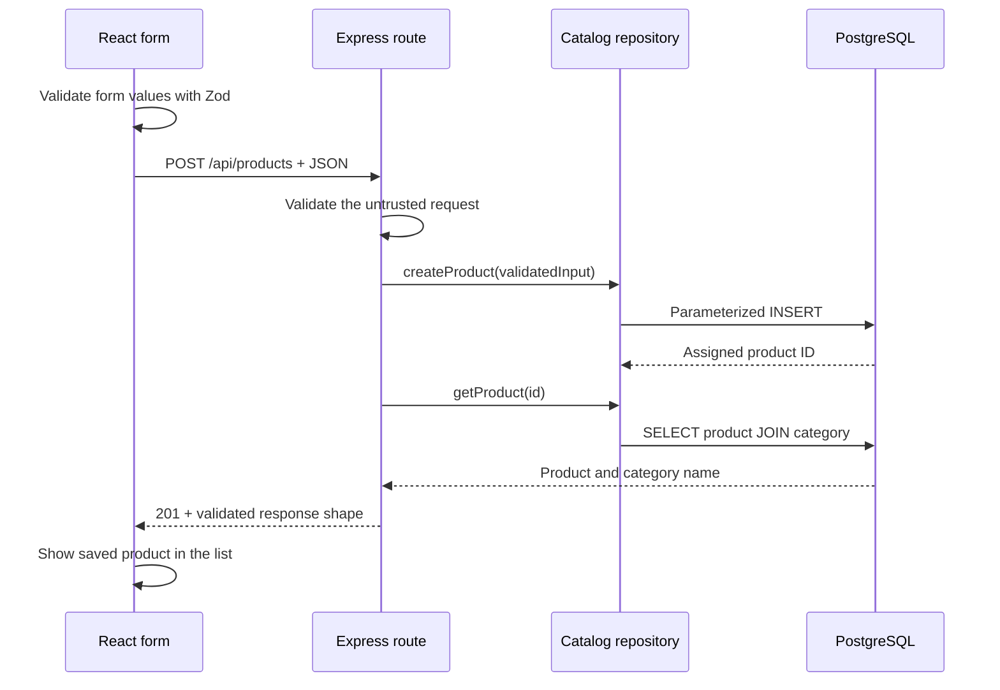

# Lesson 2b: the catalog through HTTP

Implementation continues while questions and exercises wait in [questions.md](../../questions.md). This walkthrough describes the code; it does not stand in for the learner's own explanation.

## Follow a product from the form to PostgreSQL

1. `ProductForm` in `apps/web/src/ProductsPage.tsx` reads the form. It converts the selected category ID to an integer and an empty optional barcode to null. Prices remain strings.
2. `productInputSchema` in `packages/contracts/src/index.ts` checks required fields, limits, and decimal syntax. This gives immediate feedback, but the browser is not trusted.
3. `requestJson` in `apps/web/src/catalog-api.ts` sends JSON to `POST /api/products`. It has a timeout, checks HTTP status, and validates successful responses.
4. `apps/api/src/app.ts` parses JSON with a size limit and passes API traffic to `catalog-routes.ts`. The route validates the body again using the shared schema.
5. `catalog-repository.ts` executes the insert through `pg`. SQL text contains `$1`, `$2`, etc.; the values travel separately. PostgreSQL enforces uniqueness, category references, required columns, and non-negative decimal prices.
6. The route reads the saved product with its category name and returns HTTP 201. The browser navigates to the catalog filtered by the saved SKU.

HTTP handling and SQL live in separate files. There is no service layer yet because these operations have no multi-step business workflow. Stock, purchasing, and transfers will introduce transactional business rules as they are needed. Single-row catalog writes are atomic SQL statements; the following read is a separate statement, so concurrent edits may already be reflected in its response.

## Validation, errors, and money

TypeScript checks code before it runs. Zod checks actual incoming values. Database constraints protect stored data regardless of which client writes it. The layers serve different purposes.

The server rejects unknown product fields, including `quantity`; a balance belongs to a product/store pair. It trims text, limits lengths, rejects fractional category IDs, and validates prices as strings. PostgreSQL `numeric(12, 2)` supports ten digits before the decimal point and two after it. Sending `"1.999"` is rejected before PostgreSQL can round it. Formatting NGN for display adds separators without converting the amount to a floating-point number.

The database remains the final authority on unique SKUs and barcodes. `errors.ts` maps a uniqueness failure to HTTP 409 with a field-specific message. Bad input uses 400; a missing record uses 404. Unexpected errors are logged on the server and receive a generic 500 response, without exposing SQL or stack traces. Express 5 forwards rejected async handlers to the error middleware automatically. [Express error handling](https://expressjs.com/en/guide/error-handling/)

## Read requests and navigation

The list uses bounded `page` and `pageSize` parameters, a category filter, a status filter, and literal substring search. Sorting by name and then ID gives deterministic ordering when names match. Search parameters are validated before they enter the repository. Percent signs, underscores, and quotes are searched as ordinary text rather than SQL wildcard or statement syntax.

The total count and page rows use separate queries. A concurrent catalog edit can briefly change a page's total; this is acceptable for a browsing screen. Stock calculations will need stronger transactional guarantees.

`use-resource.ts` cancels obsolete reads and keys each result to its URL and retry attempt. A slow response for an earlier search cannot replace the current search. Filters live in the browser URL, so refresh and Back preserve the view. Category select menus fetch successive bounded pages to include every category.

React Router handles browser navigation. Production Express serves `index.html` for the implemented browser routes so deep-link refresh works. API 404 handling precedes that fallback; `/api/missing` always remains a JSON 404. [React Router routing](https://reactrouter.com/start/declarative/routing)

## Tests and actual implementation issues

The API tests use Supertest and a real PostgreSQL test database. They verify invalid input, constraint errors, joins, pagination, edits, activation, and error status codes. Their writes roll back after each test. Browser tests run against a production server pointed at that same dedicated test database; records created by browser journeys are cleaned up afterward.

- The first route-ID schema used a Zod coercion pipeline whose input type did not fit the preceding string schema. TypeScript caught it. The final schema first checks the integer string, transforms it with `Number`, and validates the numeric range. [Zod transforms and pipes](https://zod.dev/api)
- Category options arrive asynchronously. An uncontrolled select mounted before those options can lose the category encoded in the URL. The select remounts when its loading phase changes; a browser regression test checks the selected category after refresh and Back.
- Express error middleware needs all four arguments for recognition. The final handler uses `next` to delegate when response headers have already been sent, preserving the correct middleware signature.
- The first browser run found that inline error text changed input labels and select options confused exact label lookup. Explicit `aria-labelledby` references keep each control's name stable; errors remain separate descriptions through `aria-describedby`.
- The phone test caught horizontal page overflow from an absolutely positioned, visually hidden table heading. Positioning the table's scroll container relative to its contents contains that heading and keeps scrolling inside the table.

SKU, barcode, and category-name uniqueness remain case-sensitive, matching the first migration. Category renaming updates product reads through a join. Products are deactivated instead of deleted, preserving their identity for future movement history. Authentication and store authorization are the next milestone; this catalog is still a local development application.
