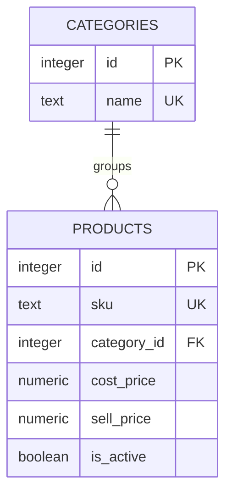

# Lesson 2a: the product catalog lives in PostgreSQL

## Start with the model

A product describes an item shared by the stores. A store's stock record describes its quantity at that location. The learner identified this distinction before this lesson.

This first part creates only the shared catalog. Stock quantities and their product/store relationship arrive in milestone 4.

| Table | One row represents | Important fields |
| --- | --- | --- |
| categories | A group such as Pantry | id, name |
| products | One item such as RICE-001 | id, sku, name, prices, category_id, is_active |



Each product has one category. A category can have many products, including none.

## Start the database

PostgreSQL 18 is already installed on this machine. On another machine, install PostgreSQL 18 and make its command-line tools available on PATH first.

From the repository root:

```sh
# Only if .env does not already exist:
cp .env.example .env

npm run db:start
npm run db:migrate
npm run db:seed
npm run db:shell
```

The local helper uses a separate cluster on port 5433. Its data lives in the ignored `.local/postgres` folder and survives a stop/start. This local cluster accepts connections without a password only on loopback; it is not the later deployment configuration.

Inside psql, try:

```sql
\dt
\d products
SELECT sku, name FROM products ORDER BY sku;
```

`\dt` lists tables, `\d products` describes a table, and `\q` leaves psql. Backslash commands belong to the psql tool; a `SELECT` is SQL sent to the database.

## Read the first migration

Open `db/migrations/1789589285900_create_catalog.sql`. A migration is a versioned change to the database structure. The runner records completed migrations in `schema_migrations`, so running `db:migrate` again applies only new ones.

The SQL is handwritten. The runner manages ordering, locking, and a transaction around migration application. Once a migration has been committed and applied, express later schema changes in a new migration.

The `Down Migration` section reverses this initial schema by dropping its tables, including their data. The normal project command only applies migrations upward; down migrations are not a normal way to clear or refresh data.

## What the constraints mean

| Definition | Meaning in this catalog |
| --- | --- |
| PRIMARY KEY | A stable identifier for each row. |
| GENERATED ALWAYS AS IDENTITY | PostgreSQL assigns the integer ID; gaps are allowed. |
| UNIQUE | Two products cannot share the same SKU or non-null barcode. |
| NOT NULL | A required value cannot be omitted. |
| REFERENCES categories(id) | The category must exist. |
| ON DELETE RESTRICT | A category cannot be removed while products still reference it. |
| CHECK | Rejects blank/space-padded text and invalid prices. |
| DEFAULT | Supplies a value when an insert leaves it out, such as is_active = true. |

Why have both `id` and `sku`? The database ID is the stable relationship key. The SKU is the unique business identifier people use, which may need correction later without changing every reference.

Prices use `numeric(12, 2)`: at most twelve decimal digits total, including two after the decimal point. These fictional prices are in NGN. PostgreSQL rounds extra fractional digits to that scale; later API validation will reject prices with excess decimal places before storing them. Negative prices and numeric NaN are rejected. The pg driver returns these decimal values as strings, avoiding accidental floating-point conversion.

A nullable barcode permits several products without barcodes, but supplied barcodes must be unique. Names and SKUs must be nonempty and have no leading/trailing spaces. Current SKU uniqueness is case-sensitive.

Database constraints also apply to SQL entered outside the application. The later API's validation will provide friendlier messages before trying a write.

## Seed data versus schema

The migration creates empty tables. `db/seed.sql` supplies three categories and six fictional products, including one inactive product.

The seed finds category IDs by name and inserts products using those IDs. It does not assume the database assigned any particular ID number. Running the seed again leaves existing products and their edits intact.

Seeding runs in one transaction: all its statements succeed together, or their changes roll back.

## Your SQL exercise — intentionally unfinished

Open `db/exercises/02-catalog.sql`.

**Exercise A:** select only active products, showing SKU, name, and selling price, ordered by price from lowest to highest.

- Use `SELECT`, `FROM`, `WHERE`, and `ORDER BY`.
- With the original seed, expect five rows. Bar soap comes first and rice comes last.
- The inactive discontinued soap should be absent.

**Exercise B:** add each product's category name with a `JOIN`. Give the category-name column an alias so it is distinguishable from the product name.

Run your worksheet with:

```sh
npm run db:shell -- -f db/exercises/02-catalog.sql
```

The file includes a starting query; its output appears before the results of queries you add. Record what you observe in `docs/learning-notes.md`.

## Verification

`npm run test:db` runs real queries against `ims_test`, never `ims`. It verifies references, uniqueness, price checks, seed/migration repeatability, and deactivation. Each constraint test uses a transaction and rolls its changes back. `npm run check` also runs the frontend checks.

The next part will carry a parameterized catalog query through Express to React. For now, the webpage remains the lesson 1 connection check; catalog data is available through SQL.

## References

- [PostgreSQL constraints](https://www.postgresql.org/docs/18/ddl-constraints.html)
- [PostgreSQL numeric types](https://www.postgresql.org/docs/18/datatype-numeric.html)
- [node-pg-migrate](https://salsita.github.io/node-pg-migrate/)
