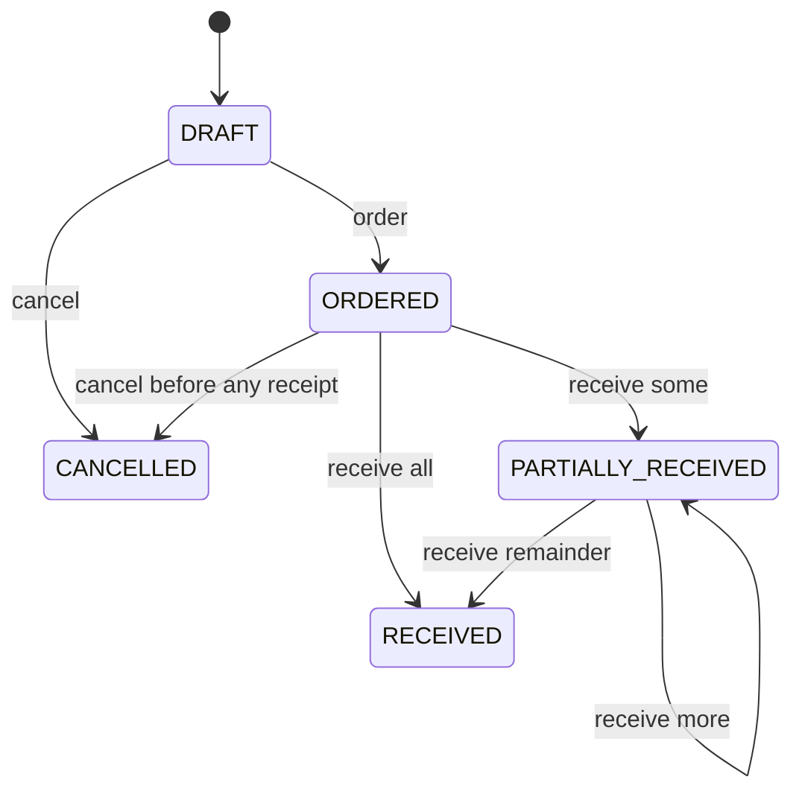

# Purchasing: promises become stock when a delivery arrives

A purchase order records an agreement with a supplier. Creating or ordering it changes no stock. Receiving it records the quantities that physically arrived at its destination location. The implementation preserves the prototype's lifecycle while replacing its max-number lookup with a database sequence and adding document locks and request IDs.

## Follow one purchase

Order 10 bags of rice at ₦10.25 each and 10 cartons of juice at ₦10.25 each. The total is ₦205.00. The fictional prices keep the arithmetic easy to check.

1. An administrator or the destination's manager creates a draft. The API validates positive whole quantities, decimal-string costs, active products and supplier, and unique product lines. PostgreSQL assigns a number such as PO-42.
2. Marking it ordered changes DRAFT to ORDERED and records ordered_at. No movement exists yet.
3. Four bags arrive. Receiving that line changes received_qty from 0 to 4, adds 4 to rice stock, inserts a PURCHASE movement, and marks the order PARTIALLY_RECEIVED.
4. Six more bags and all 10 cartons arrive. A second receipt posts two movements and marks the order RECEIVED with closed_at.
5. The line costs remain the agreed costs, even if the catalog's cost changes later. The catalog cost is only a default when adding an order line. This milestone does not implement weighted-average costing, taxes, freight, or accounting entries.

A draft's lines are reviewed before ordering. There is currently no draft-edit endpoint: cancel an incorrect draft and create its replacement. Cancellation preserves the order and creates no stock movements. After a receipt, correction requires an explained stock adjustment; supplier returns and correcting the order's received counters are separate future workflows.

## Find the boundaries in the code

- `packages/contracts/src/index.ts` defines supplier, order, and receipt schemas, with TypeScript types inferred from them. Server validation remains mandatory.
- `purchase-routes.ts` translates HTTP into validated inputs and status codes.
- `purchase-service.ts` decides which role/location can act and whether the state allows that action.
- `purchase-repository.ts` contains parameterized SQL for headers, lines, contacts, and status changes.
- `applyStockMovement` in `stock-service.ts` is the common stock writer for direct stock changes and purchase receipts. It runs inside its caller's transaction.
- `PurchasesPage.tsx` collects quantities, displays results, and keeps a receipt UUID stable across a retry. It never decides whether a write is authorized.

Suppliers are shared catalog records. Only ADMIN can create, edit, deactivate, or reactivate them. ADMIN and the destination's MANAGER can create, order, and cancel purchases. STAFF can receive at their assigned store. VIEWER has read-only access across stores. A request for `/purchase-orders/42/receive` looks up order 42 and checks its stored destination; the client cannot replace that destination in the receipt body.

## One receipt, one connection, one transaction

The transaction runner checks out one PostgreSQL connection. Receiving then:

1. Locks the order header using FOR UPDATE and checks access to its actual location.
2. Claims the UUID in stock_requests, including the user, operation, order ID, and sorted receipt payload. An identical retry returns the previous result even if the order has since completed. A different payload or user gets HTTP 409.
3. Confirms the order is open for receiving. Every requested line must belong to it and fit its outstanding quantity.
4. Processes lines in product-ID order. It increments each received counter, locks the product/store balance, updates stock, and inserts a linked movement.
5. Updates the overall status, saves the result for retries, and commits.

Every statement uses the same connection. If the second movement fails, PostgreSQL rolls back the first movement, both line counters, every balance update, the status, and the UUID claim. There is no partial commit hidden inside the stock helper. See [pg transactions](https://node-postgres.com/features/transactions).

Two receivers for the same order cannot pass the outstanding-quantity check using the same old counters: the second waits for the header lock and then reads the updated lines. Cancellation takes the same lock. Different orders can still receive concurrently. Sorting their product IDs prevents opposite lock orders across shared balances. PostgreSQL describes [row locks and deadlocks](https://www.postgresql.org/docs/18/explicit-locking.html).

The database also rejects duplicate products on an order, received quantities above ordered quantities, invalid movement signs, and purchase movements without a linked order line. A composite foreign key ensures the movement product matches that line. The service derives the destination store from the order.

## Why sequence numbers can have gaps

The prototype looked up the largest document number and added one. Concurrent requests could choose the same next number. PostgreSQL nextval assigns each caller a distinct number, including concurrent callers. A rolled-back order can consume a number; gaps are expected and do not mean stock is missing. See [PostgreSQL sequences](https://www.postgresql.org/docs/18/functions-sequence.html).

## Existing orders and inactive records

Creating or ordering a purchase requires an active supplier and active products. Receiving an already ordered delivery remains possible after deactivation: goods can still arrive after the catalog changes. Products with stock remain visible, and history retains the order-line link. Supplier names and product names are current catalog names; the order's quantities and costs are saved values.

Receipts accept at most 50 lines, each with 1–1,000,000 units. Leave unreceived lines out of the API payload. The browser turns blank fields into omitted lines; zero is rejected rather than silently ignored. Lists have bounded pagination and literal substring search. Dates display in Africa/Lagos and all money crosses the API as decimal strings.

## Checks and implementation notes

The API tests use the separate PostgreSQL test database and real concurrent connections. They check partial/full receipt, unique numbers, duplicate UUIDs, changed UUID payloads, concurrent distinct receipts, competing order transitions, cancellation races, permissions, invalid quantities, and line ownership. A temporary test-only trigger deliberately fails the second purchase movement and verifies complete rollback, then verifies that the same UUID can safely retry after the failure is removed.

Browser journeys exercise creating a draft, receiving across manager/staff logins, lost-response retries, cancellation, supplier editing/deactivation, over-receipt errors, and a read-only mobile view. The ledger verifier checks purchase movements together with opening stock, sales, and adjustments.

During implementation review, reusing the pagination component inside the draft form exposed its missing button type: HTML buttons default to submit. Pagination and error-retry buttons now explicitly use type="button", so finding the next product does not submit the draft. The first browser run also caught dropdown labels that included option text. Explicit label references now give each dropdown a stable accessible name. No new dependency was needed for purchasing.

Questions and practice tasks are in the root `questions.md`. These explanations describe implementation decisions; they do not stand in for the learner's answers.
