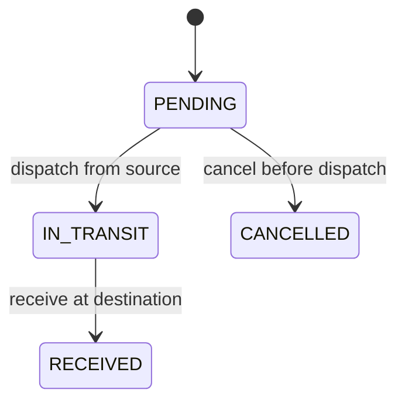

# Transfers: stock leaves before it arrives

A transfer moves existing stock between locations. It does not purchase new stock. The source and destination keep separate balances, and the journey between them is represented explicitly.

## Trace five units

Start with 20 units at Lagos Central and 20 at Ibadan Market. Create a transfer of 5 units from Lagos to Ibadan.

| State | Lagos on hand | In transit | Ibadan on hand | Total accounted for |
| --- | ---: | ---: | ---: | ---: |
| PENDING | 20 | 0 | 20 | 40 |
| IN_TRANSIT | 15 | 5 | 20 | 40 |
| RECEIVED | 15 | 0 | 25 | 40 |

Creating a pending transfer neither changes nor reserves stock. A sale can use that stock before dispatch, so dispatch must check the current source balance. Dispatch records -5 at the source. Receipt later records +5 at the destination. Stock in transit is derived from the lines of IN_TRANSIT transfers; it is not added to either location's on-hand balance.

All lines dispatch together and all lines arrive together, preserving the prototype's lifecycle. Partial receipts, short deliveries, losses in transit, and returns are not implemented. Confirm receipt only when all listed goods have arrived. Stock already in transit cannot be cancelled through this workflow. Incorrect pending transfers can be cancelled and replaced; there is no line-edit endpoint.

## Follow the request through the code

1. `TransfersPage.tsx` collects source, destination, and whole-unit quantities. The product picker is shared with purchasing because both now need the same search and pagination behavior.
2. Shared Zod schemas reject same-store transfers, empty or duplicate lines, invalid IDs, zero/fractional quantities, and more than 50 lines.
3. `transfer-routes.ts` translates HTTP requests into service operations.
4. `transfer-service.ts` checks the stored source/destination, the role, and the current state. It owns the transaction boundary.
5. `transfer-repository.ts` reads and locks the document, inserts lines, and updates status using parameterized SQL.
6. `applyStockMovement` updates balances and inserts linked TRANSFER_OUT or TRANSFER_IN movements on that same transaction connection.

The transfer migration introduces its own number sequence, header and line tables, timestamps, indexes, and movement links. A database check rejects equal source and destination IDs. Unique lines reject repeated products. Each movement has a composite foreign key linking it to a transfer line with the same product. A unique `(transfer_line_id, kind)` index permits at most one dispatch and one receipt movement per line.

## Access depends on which side is acting

ADMIN can act at either end. A MANAGER can create and cancel only from their assigned source location. MANAGER and STAFF can dispatch from their own source and receive at their own destination. VIEWER can read all transfers and cannot write.

Managers and staff can read a transfer when their store is either its source or destination. This allows the receiving team to see expected goods before they arrive. A staff member at Lagos can see a Lagos → Ibadan transfer, dispatch it, and follow its progress. That same staff member cannot receive it on Ibadan's behalf.

The destination picker uses `/api/transfers/destinations`, a paginated directory of location names, codes, kinds, and IDs. It supplies no balances or purchase data. Seeing a location's name to address a transfer does not grant access to that location's books. `/api/stores`, stock, and purchasing retain their normal access checks.

## Dispatch and receipt each commit once

For either stock-affecting action, the service locks the transfer header with FOR UPDATE, checks access to the relevant end, and claims a request UUID. The saved payload includes the action and transfer ID, so a dispatch UUID cannot be reused as a receipt UUID. A matching replay from the same user returns the original result before checking the now-changed state.

The service processes product IDs in sorted order. It calls the stock writer on the same connection for every line, updates the transfer status/timestamp, saves the result, and commits. A later-line failure rolls back earlier lines, balances, movements, the status change, and the request claim. Cancellation locks the same header, so it cannot pass a stale PENDING check while dispatch succeeds.

Two different transfers can compete for the same source stock. Their balance locks and conditional updates prevent both from subtracting more than is available. One transfer can fail and remain pending; the other still commits correctly. PostgreSQL documents [row locking and lock order](https://www.postgresql.org/docs/18/explicit-locking.html), and pg requires [one connection for each transaction](https://node-postgres.com/features/transactions).

The browser retains its action UUID after a lost response. Retrying asks for the saved result instead of moving the goods again. A replay after a later action still describes the original action: replaying dispatch can return IN_TRANSIT after receipt has completed. The browser reloads the transfer for its current status.

## Catalog changes and verification

Creating a transfer requires active products. Existing transfers can dispatch and receive after a product is deactivated: physical stock still exists and may need to be moved. This follows the purchasing decision to allow existing workflows to finish. Stock history includes the transfer number and keeps its line reference.

`npm run db:verify-ledger` compares every store balance to summed movements. Transfer-out and transfer-in entries participate in that sum. The test fixtures also verify that source plus destination plus in-transit quantities remain accounted for throughout the journey.

API tests cover competing transfers, repeated and distinct concurrent dispatch/receipt requests, cancellation races, insufficient stock on a later line, a forced second-line destination failure, and access to each end. Browser tests use manager, staff, administrator, and viewer accounts to exercise actual create/dispatch/receive flows, lost-response retries, cancellation, errors, and mobile viewing. Fixtures use the same stock service for opening balances, on the guarded test database.

Implementation notes: extracting the existing product picker avoided maintaining two different search/pagination flows. The destination directory deliberately exposes only routing metadata; making all stock records readable just to populate a dropdown would break store permissions. No new dependency was needed.

All learner questions remain in the private local `questions.md`; feature completion does not mark the exercises complete.
