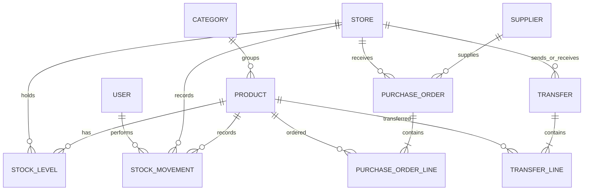

# Milestone 0: understand the prototype

The reference project is `/Users/lorenzoworx/Downloads/ubaInventory`. It uses Next.js, Prisma, and PostgreSQL. This rebuild keeps the inventory concepts and replaces the application structure with React, Express, and SQL.

This map comes from reading the source; it is not a claim that every original feature was tested. The old README lists CSV import as future work, but the source already contains an import system.

## Feature map

Paths in this table are relative to the reference project, not this repository.

| Subsystem | Purpose | Starting point in the prototype | Rebuild |
| --- | --- | --- | --- |
| Catalog | Shared products, SKUs, categories, and prices | `src/app/(app)/products/actions.ts` | Milestone 2 |
| Identity and store access | Determine who is signed in and which store they can use | `src/lib/auth.ts`, `src/lib/context.ts` | Milestone 3 |
| Stock | Record changes and maintain the current balance | `src/lib/stock.ts`, `src/app/(app)/stock/actions.ts` | Milestone 4 |
| Purchasing | Order stock from suppliers and receive it, including partial deliveries | `src/lib/purchasing.ts` | Milestone 5 |
| Transfers | Move stock between stores with an in-transit stage | `src/lib/transfers.ts` | Milestone 6 |
| Reporting | Read balances and movement history to calculate summaries | `src/app/(app)/reports/page.tsx` | Milestone 7 |
| Imports and reconciliation | Rebuild mirrored stock from retained exports, flag discrepancies, and compare till totals | `src/lib/import.ts`, `src/lib/zreconcile.ts`, `src/lib/detectors.ts` | Deferred |

## The important relationships

A product belongs to the shared catalog. Its quantity belongs to a **product/store pair**. One product can have 20 units in one store and 3 in another.



Every transfer has two separate store references: source and destination. The compact diagram combines them into one relationship label.

`StockMovement` is the history of changes. `StockLevel` is a stored current balance for fast reads. They must agree:

```text
current quantity = sum of all signed movements for this product and store
```

Positive movements add stock; negative movements remove it. Product deactivation preserves historical references.

## Follow one sale through the old application

Imagine Downtown Market has 10 bags of rice and a staff member records a sale of 3.

1. The stock form submits product ID, movement type, and quantity to `recordStockChange()` in the stock actions file.
2. The server obtains the authenticated user and active store. It validates the form and turns the entered quantity `3` into a signed sale quantity `-3`.
3. The action calls `applyMovement()` in `src/lib/stock.ts`. That function validates integer/sign rules, rejects live writes to shadow stores, and obtains the product's price stamps.
4. Inside a transaction, it ensures a stock balance row exists and runs a conditional update equivalent to:

   ```sql
   UPDATE stock_levels
   SET quantity = quantity - 3
   WHERE product_id = $1 AND store_id = $2 AND quantity >= 3;
   ```

   This is explanatory SQL for the Prisma operation; these are not the original table names.

5. If no row updates, there was insufficient stock. Throwing an error rolls back the transaction.
6. If the update succeeds, it inserts a movement with quantity `-3`, the user, and the product/store references. Both writes commit together; if either fails, neither persists.
7. The action revalidates the stock page, and the UI displays 7 units. The history explains how 10 became 7.

The sequence inside the old transaction is balance update **then** movement insertion. Atomicity comes from committing both together, not from writing the history first.

### Why a transaction alone is not enough

Two requests could both read a balance of 10 and each try to sell 7. A separate read followed by an unchecked decrement is unsafe. The conditional update makes the quantity check part of the write. Only one sale can succeed, leaving 3.

### How other features build on this

- A purchase receipt posts a positive `RECEIPT` movement at the receiving store.
- Transfer dispatch posts negative `TRANSFER_OUT` at the source. The destination receives nothing yet.
- Transfer receipt later posts positive `TRANSFER_IN` at the destination.
- An adjustment records a correction with a reason rather than silently replacing the balance.
- Reports read the balances and history; they should not modify stock.

## Lessons to carry forward

- The original purchasing and transfer actions do not consistently authorize access to the specific store record. New API tests must cover cross-store attempts.
- Original document numbering reads the previous number and adds one. Concurrent creation can collide; use database sequences in the rebuild.
- Some lifecycle code reads status and then updates it without locking the document. Transactions must also protect the state transition against concurrent requests.
- Existing integration tests write fixtures into the development database. The rebuild will use a separate test database.
- Import-specific fields make the old stock write path longer. The first release can teach the core rule without introducing the import pipeline.

Before moving on, try explaining the difference between a product, its balance at a store, and a movement. Then explain what a transfer looks like while a truck is still on the road.
